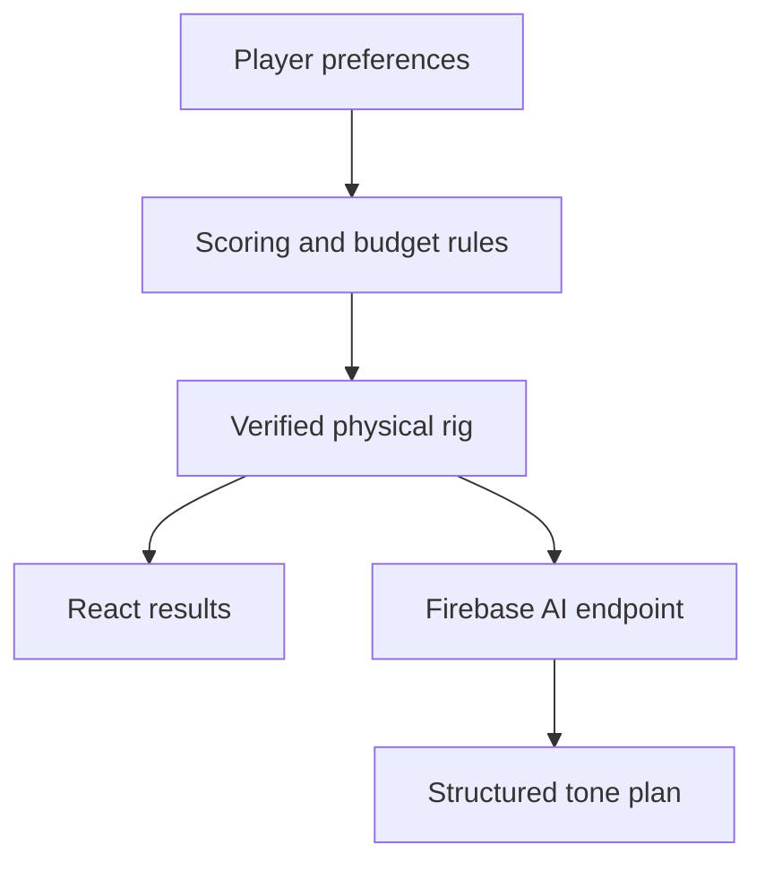

<p align="center">
  
</p>

<p align="center">
  A full-stack recommendation platform that builds complete physical guitar and bass rigs for metal and hardcore musicians—then uses AI to turn each verified build into a practical tone plan.
</p>

<p align="center">
  <a href="https://brutal-rig.web.app"><strong>Live application</strong></a> ·
  <a href="https://github.com/ChristianBarajas/brutal-rig">Source code</a>
</p>

## The problem

Building a heavy rig usually means hours of YouTube reviews, forum threads, compatibility checks, and price comparisons. Generic gear lists also miss the details that matter: the player's budget, instrument, favorite bands, preferred brands, shopping preference, and whether every part of the signal chain actually works together.

Brutal Rig compresses that research into one guided workflow. It recommends a complete physical rig, explains each choice, verifies the total, and produces usable starting settings for the exact gear selected.

## What the application does

- Builds guitar and bass rigs across entry-level, midrange, and professional budgets.
- Supports hardcore, metalcore, death metal, thrash, nu-metal, and doom/sludge tone profiles.
- Scores favorite bands and preferred brands against a curated physical-gear catalog.
- Supports best-value, new-only, and used-first shopping strategies.
- Validates instruments, amplification, tuners, required cables, and head/cab compatibility.
- Keeps the complete recommendation inside the selected budget.
- Explains item-level match scores and the role of every component.
- Generates an AI Rig Tech plan with a signal chain, starting settings, setup notes, and next upgrade priority.
- Handles guitar and bass recommendations through the same tested product flow.

## Why the recommendation engine is hybrid

The AI model is not trusted with shopping math, prices, or product compatibility. Those are deterministic software-engineering problems, so the local recommendation engine handles them first.

1. The user submits budget, instrument, tone, band, brand, and shopping preferences.
2. JavaScript scoring rules rank items from the curated catalog.
3. Budget and compatibility rules assemble and validate the complete physical rig.
4. The React results page renders the verified products, prices, and explanations.
5. On request, the server sends only the sanitized, already-verified rig to OpenAI.
6. Structured Outputs return a predictable tone plan that the UI can validate and render.



This separation keeps the core recommendation useful even when the AI service is unavailable and prevents a model response from silently changing the shopping list or budget.

## AI Rig Tech integration

AI Rig Tech is a secure server-side feature built with Firebase Cloud Functions and the OpenAI Responses API.

The request includes the generated rig, selected tone, favorite bands, instrument type, budget, total, and remaining budget. The model is instructed to work only with those products and return:

- A short tonal summary
- An ordered signal chain
- Component-specific starting settings with explanations
- Setup and safety notes
- One realistic next-upgrade priority

The response uses a strict JSON schema. Incomplete or malformed output is rejected before it reaches the interface. The client never receives the OpenAI API key and never calls OpenAI directly.

### Production safeguards

- `OPENAI_API_KEY` is stored in Firebase Secret Manager.
- The OpenAI key is restricted to the Responses API and its project is model-limited.
- Requests and generated rigs are sanitized and schema-validated server-side.
- Requests are limited per client before the model is called.
- The function is capped at one instance with low concurrency to control burst cost.
- Prompts prohibit replacements, price changes, unlisted products, and software amp sims.
- OpenAI billing uses a separate project with auto-reload disabled and a hard spend limit.

The current request limiter is intentionally small and in-memory. Before significant public traffic, the next step is Firebase App Check plus a distributed limiter such as Firestore or Redis.

## Tech stack

| Layer | Technology |
| --- | --- |
| Interface | React 19, React Router, Tailwind CSS 4, Framer Motion, Lucide React |
| Build tooling | Vite 8, ESLint |
| Recommendation engine | JavaScript rules, scoring, pricing, and validation modules |
| AI backend | Firebase Cloud Functions 2nd gen, Node.js 22, OpenAI Responses API, Structured Outputs |
| Infrastructure | Firebase Hosting, Secret Manager, Google Cloud Run infrastructure |
| Quality | Node test runner, scenario verification scripts, GitHub Actions |

## Testing and quality gates

```bash
npm run check
```

The single verification command runs:

- ESLint across the application and function code
- Guitar budget scenarios from $400 to $4,100
- Bass budget scenarios from $500 to $4,100
- New-only, used-first, and best-value pricing scenarios
- Server request-method and payload validation tests
- Rig sanitization and malformed-rig rejection tests
- Structured AI request and response parsing tests
- Rate-limit behavior tests that confirm the model is not called after a limit
- A complete production build

The same checks run in GitHub Actions on pushes and pull requests.

## Run locally

Requirements: Node.js 22+ and npm.

```bash
git clone https://github.com/ChristianBarajas/brutal-rig.git
cd brutal-rig
npm install
npm install --prefix functions
npm run dev
```

The deterministic rig builder works without an API key. AI Rig Tech needs the Firebase function or local emulator.

For emulator development, copy `functions/.secret.local.example` to `functions/.secret.local`, replace the placeholder, and keep that file private.

## Deploy

Cloud Functions deployment requires a Firebase project on the Blaze plan. Store the key server-side and deploy both surfaces:

```bash
firebase functions:secrets:set OPENAI_API_KEY
firebase deploy --only functions,hosting
```

Before exposing an AI endpoint publicly, configure an OpenAI project spend limit and keep automatic credit reload disabled unless ongoing paid usage is intentional.

## Project structure

```text
src/components/builder/       Six-step preference flow
src/components/results/       Verified rig and AI Rig Tech UI
src/data/                     Curated gear and artist profiles
src/recommendation/           Budget, pricing, and scoring rules
src/utils/generateRig.js      Deterministic recommendation orchestration
src/services/rigTech.js       Client-to-function integration
functions/src/rigTechCore.js  AI validation, prompt, schema, and parsing
functions/index.js            Secured Firebase HTTP function
functions/test/               Backend unit tests
scripts/                      End-to-end rig scenarios
```

## Engineering decisions

- **Deterministic before generative:** prices, products, compatibility, and totals remain auditable.
- **Progressive enhancement:** the product still solves its main problem without AI.
- **Structured AI output:** the UI consumes a contract instead of untrusted free-form text.
- **Server-only secrets:** browser bundles contain no provider credentials.
- **Cost-aware infrastructure:** the endpoint has request, instance, concurrency, and account-level spending controls.
- **Physical gear focus:** recommendations build a real-world signal chain rather than defaulting to plugins or amp simulations.

## Roadmap

- Firebase Authentication and saved rigs
- Live retailer or affiliate pricing instead of catalog estimates
- Larger professional bass and extended-range guitar catalogs
- Firebase App Check and distributed production rate limiting
- Shareable rig URLs and comparison views
- Accessibility and device-level end-to-end tests

## Developer

Built by **Christian Barajas**, a Computer Science graduate from California State University, Fullerton.

- [GitHub](https://github.com/ChristianBarajas)
- [Live application](https://brutal-rig.web.app)
