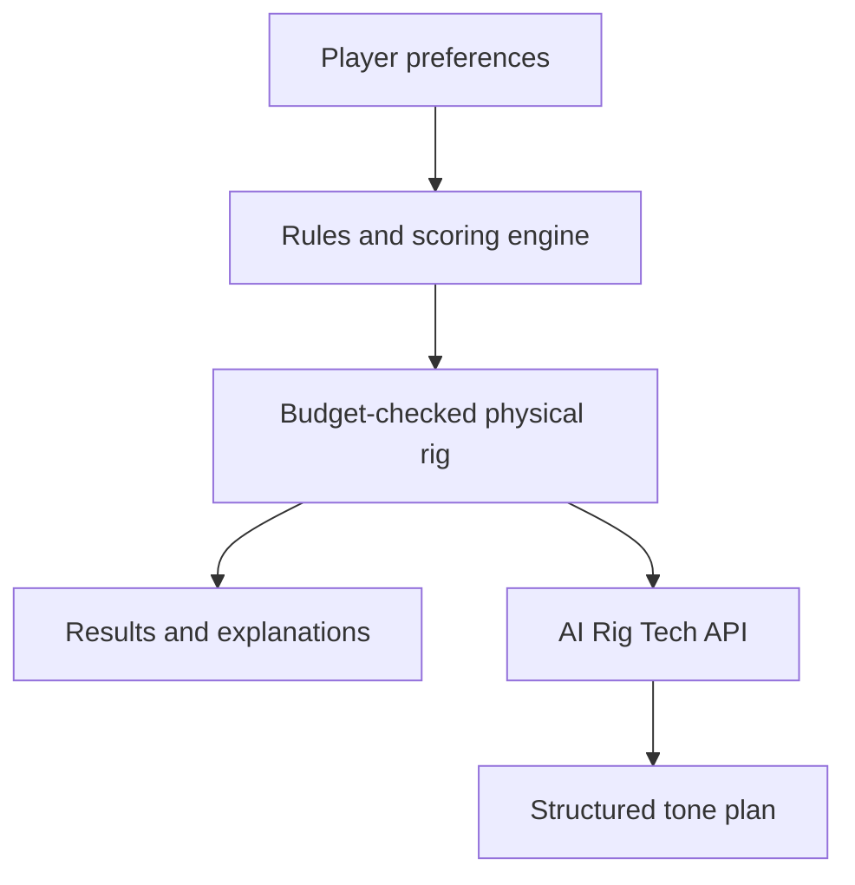

# Brutal Rig

Brutal Rig is a full-stack recommendation platform for metal and hardcore
musicians. It builds a complete physical guitar or bass rig from a player's
budget, tone, favorite bands, preferred brands, and new-versus-used shopping
preference—then explains why every item belongs in the build.

The project is designed to replace hours of disconnected gear research with one
clear, budget-checked recommendation.

## What works

- Six-step guitar and bass rig builder
- Budgets from entry-level to professional tiers
- Hardcore, metalcore, death metal, thrash, nu-metal, and doom/sludge profiles
- Favorite-band and preferred-brand scoring
- Best-value, new-only, and used-first price paths
- Complete rig validation: instrument, amplification, tuner, required cables,
  and head/cab compatibility
- Item-level match scores and recommendation explanations
- AI Rig Tech tone plans with a signal chain, starting settings, setup notes,
  and an upgrade priority
- Basic per-client AI request limiting and single-instance cost protection
- Automated guitar, bass, pricing-preference, API-validation, and structured
  output tests

## Why the recommendation engine is hybrid

Brutal Rig does not ask an AI model to invent a shopping list or perform budget
math. A deterministic JavaScript engine selects products from the catalog,
checks compatibility, ranks preferences, chooses new or estimated-used prices,
and guarantees that the completed rig stays within the selected budget.

The optional AI Rig Tech receives only that verified rig. It turns the result
into useful setup guidance while a strict JSON schema prevents missing UI
fields. The prompt explicitly prevents the model from replacing products,
changing prices, adding amp sims, or inventing unlisted gear.



## Tech stack

- React 19 and React Router
- Vite 8
- Tailwind CSS 4
- Framer Motion and Lucide React
- Firebase Hosting
- Firebase Cloud Functions, 2nd generation on Node.js 22
- OpenAI Responses API with Structured Outputs
- Node's built-in test runner and GitHub Actions

## Run locally

Requirements: Node.js 22+ and npm.

```bash
npm install
npm install --prefix functions
npm run dev
```

The app runs without an API key, but the AI Rig Tech button needs the Firebase
function or emulator to be available.

## Verify the project

```bash
npm run check
```

That command runs linting, the deterministic recommendation scenarios, the AI
API unit tests, and a production build. The same checks run automatically on
GitHub pull requests and pushes to `main`.

## Configure AI Rig Tech

The OpenAI API key belongs only in the server-side Firebase secret. Never put it
in a `VITE_` variable or commit it to Git.

```bash
firebase functions:secrets:set OPENAI_API_KEY
firebase deploy --only functions,hosting
```

For the local Firebase emulator, copy `functions/.secret.local.example` to
`functions/.secret.local`, replace the placeholder, and keep that file private.

Cloud Functions deployment requires a Firebase project on the Blaze plan. Set
an OpenAI project spending limit before making a public AI endpoint available.

## Project structure

```text
src/components/builder/       Builder steps
src/components/results/       Rig results and AI Rig Tech interface
src/data/                     Physical gear and artist profiles
src/recommendation/           Budget, pricing, and scoring rules
src/utils/generateRig.js      Deterministic recommendation engine
functions/                    Secure AI API and tests
scripts/                      End-to-end recommendation scenarios
```

## Next production milestones

- Firebase Authentication and Firestore saved rigs
- Live retailer or affiliate pricing instead of catalog estimates
- A broader professional bass catalog
- Firebase App Check and distributed rate limiting before scaling AI usage
- Product screenshots and a short architecture/demo video

## Developer

Built by **Christian Barajas**, Computer Science graduate from California State
University, Fullerton.

- [GitHub](https://github.com/ChristianBarajas)
- Live app: [brutal-rig.web.app](https://brutal-rig.web.app)
