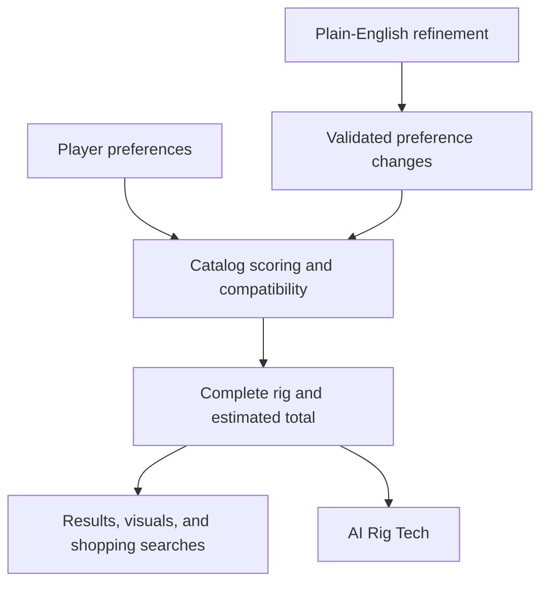

<p align="center">
  
</p>

<p align="center">
  <strong>Build the rig. Find your sound.</strong><br />
  A guitar and bass rig builder for metal, hardcore, and everything heavy.
</p>

<p align="center">
  <a href="https://brutal-rig.web.app"><strong>Try Brutal Rig</strong></a> ·
  <a href="https://github.com/ChristianBarajas/brutal-rig">View the source</a>
</p>

## Built for players

You know the sound you want. Finding a complete setup that fits your budget takes more work: comparing guitars, amps, cabinets, pedals, and used prices; checking what connects; and figuring out which parts actually matter for your style.

**Brutal Rig turns those decisions into a playable starting point.** Choose guitar or bass, set a total budget, pick a heavy tone, and add the bands and brands you care about. The builder assembles a physical rig from a curated catalog, explains why each piece fits, and shows the estimated cost of the entire setup. When you want to go deeper, AI Rig Tech turns that exact gear list into practical tone guidance.

The builder is open to everyone. Sign in only when you want to keep your rigs across devices.

## The player experience

1. **Describe your sound.** Choose an instrument, budget, tone, artist influences, preferred brands, and whether to shop for value, new gear, or used gear first.
2. **See a complete rig.** Get an instrument, amplification, tuning tools, required cables, and any pedals or accessories the budget can support. The result includes item-level reasons, estimated prices, and a total.
3. **Explore the gear.** Browse consistent studio-style visuals and open shopping searches for each item. Listings let you verify the exact model, condition, and current price.
4. **Dial it in.** Ask AI Rig Tech for a signal chain, starting settings, setup notes, and an upgrade priority based on the gear in your build.
5. **Make it yours.** Tell Refine My Rig something like “make it more hardcore and keep the complete rig under $1,200.” Preview the interpreted preferences, changed gear, and new estimated total before applying anything.
6. **Keep what works.** Save builds to a private account, reopen them, rename them, and revisit their AI tone plans.

Brutal Rig supports guitar and bass; hardcore, metalcore, death metal, thrash, doom/sludge, and nu metal; and starter through professional budgets. It also keeps an unfinished builder draft on the current device.

## How the recommendations work

The gear catalog contains instruments, amplifiers, cabinets, tuners, pedals, and essentials with prices and attributes. JavaScript recommendation rules score the options against the player's preferences, assemble a complete signal chain, check amplifier and cabinet compatibility, and calculate the total. The results page shows the selected condition and the reason each item earned its place.

This gives the AI a solid foundation: it can help a player understand and revise a rig while catalog rules remain responsible for product selection, connections, and budget math.


```mermaid
flowchart TD
    A["Player preferences"] --> B["Catalog scoring and compatibility"]
    B --> C["Complete rig and estimated total"]
    C --> D["Results, visuals, and shopping searches"]
    C --> E["AI Rig Tech"]
    F["Plain-English refinement"] --> G["Validated preference changes"]
    G --> B
```

### Two ways AI helps

**AI Rig Tech** receives a sanitized snapshot of the finished rig through a Firebase Cloud Function. It uses the OpenAI Responses API to return a structured tone plan: summary, signal chain, gear-specific starting settings, setup notes, and an upgrade priority. Its instructions keep the advice tied to the items already selected.

**Refine My Rig** translates a player's request into supported builder choices: instrument, budget, tone, listed bands and brands, or shopping preference. The server validates the structured response against allowed values and budget limits. The browser then runs the regular recommendation engine to preview the resulting gear. The player decides whether to apply it, and a previously saved rig is left intact.

Both AI features run only when requested. The product still builds rigs when AI is unavailable. Exact tunings and physical setups are flagged as details to verify because they are not current builder constraints.

## Accounts and the full-stack system

The interface is a React and Vite application with responsive Tailwind CSS styling and Framer Motion interactions. Firebase Hosting serves the site and routes AI requests to Node.js Cloud Functions. The OpenAI key stays in Firebase Secret Manager; the browser calls Brutal Rig's endpoints rather than OpenAI directly.

Firebase Authentication supports Google and email/password sign-in. Cloud Firestore stores user-owned rig snapshots and optional AI plans at `users/{uid}/rigs/{rigId}`. Security Rules limit access to the matching signed-in user. Local storage preserves an unfinished builder session without requiring an account.

| Layer | Implementation |
| --- | --- |
| Web app | React 19, React Router, Vite 8, Tailwind CSS 4, Framer Motion |
| Recommendations | Curated JavaScript gear catalog, scoring, pricing, budget and compatibility rules |
| AI | OpenAI Responses API, strict JSON schemas, Firebase Cloud Functions on Node.js 22 |
| Accounts and data | Firebase Authentication, Cloud Firestore, user-scoped Security Rules |
| Delivery and checks | Firebase Hosting, GitHub Actions, ESLint, Node tests, scenario scripts |

AI requests are validated and rate limited before model use. Responses are checked before they reach the interface. The functions cap instances and concurrency to limit bursts. The current request limiter is in memory per function instance; a distributed limiter and App Check would be appropriate at larger scale.

## Product notes

- Prices are **catalog estimates**, including used-condition estimates. Shopping buttons open searches; Brutal Rig does not provide live stock, checkout, or guaranteed retailer pricing.
- Most gear visuals are generated illustrations for browsing, with a credited adapted Boss SD-1 photograph. Verify exact finishes, model details, and packaging on the retailer listing.
- Tone settings are starting points for the player's instrument, room, and hands. The builder does not guarantee an exact artist tone or a particular physical setup.
- If no complete setup fits a requested refinement, the player sees an error and can adjust the budget or shopping preference.

## Run and verify

Requirements: Node.js 22+, npm, and a Firebase project for account and AI features.

```bash
npm ci
npm ci --prefix functions
npm run check
npm run dev
```

`npm run check` runs ESLint, guitar and bass budget scenarios, a 144-scenario preference matrix, application and Cloud Function tests, and a production build. The same checks run in GitHub Actions.

The catalog builder works in the Vite development server without an API key. For local authentication, copy `.env.example` to `.env.local` and supply the Firebase Web App configuration. The plain Vite server does not serve Firebase's `/api` rewrites; AI requests need the deployed functions or a locally configured Functions emulator. Keep the OpenAI key server-side in Firebase Secret Manager or a private emulator secret file.

To deploy the site and backend after a successful build:

```bash
firebase use brutal-rig
firebase deploy --only firestore:rules,functions,hosting
```

## Creator

Built by **Christian Barajas**, a full-stack developer and guitarist from Diamond Bar, California, and a Computer Science graduate of California State University, Fullerton.

[Live app](https://brutal-rig.web.app) · [GitHub](https://github.com/ChristianBarajas) · [Portfolio](https://christian-barajas-portfolio.web.app)
